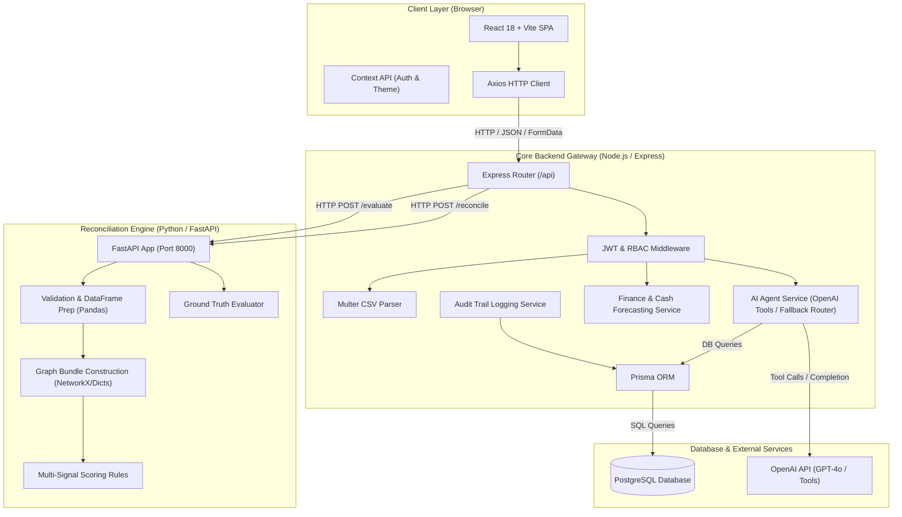
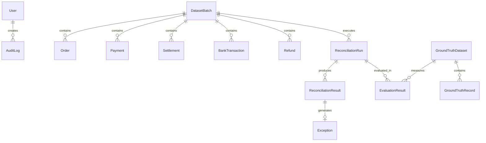
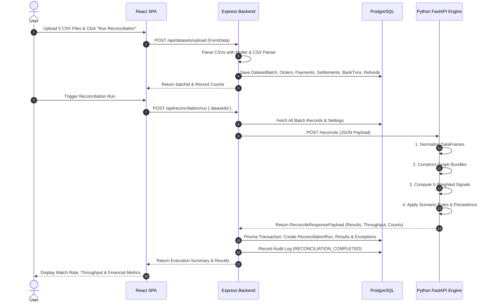
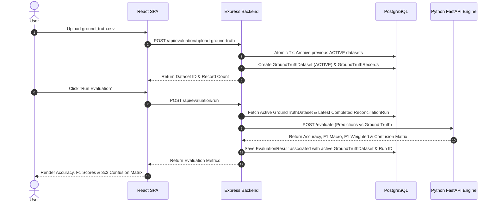
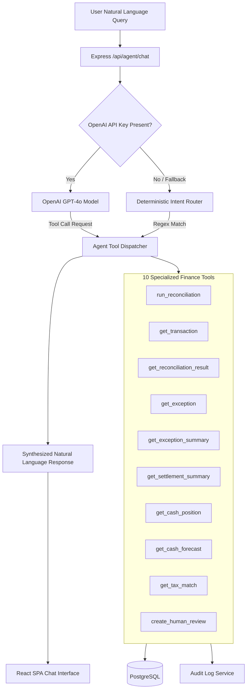

# ReconcileAI — System Architecture & Technical Specifications
## Razorpay Hackathon 2026 — Track 04: AI Finance Controller

This document provides a comprehensive specification of the system architecture, component interactions, database schemas, financial decision engines, and security framework powering **ReconcileAI — AI Finance Controller**.

---

## 1. Executive Summary & Purpose

**ReconcileAI** is an enterprise-grade AI Finance Controller platform engineered for multi-source financial data ingestion, automated deterministic reconciliation, AI-driven natural language financial investigation, tax verification, liquidity forecasting, and ground-truth evaluation. 

Designed specifically for complex payment ecosystem reconciliation (Orders, Payments, Settlements, Bank Deposits, Refunds), ReconcileAI pairs high-speed graph matching algorithms with OpenAI tool-calling capabilities and strict PostgreSQL persistence to process financial records with verified accuracy and audit compliance.

---

## 2. High-Level System Architecture

ReconcileAI employs a decoupled 3-tier microservice architecture:
1. **React Single Page Application (SPA)**: Modern, responsive TypeScript user interface.
2. **Node.js / Express Core API Gateway**: Authentication, RBAC, file parsing, business logic, PostgreSQL ORM, OpenAI agent orchestration.
3. **Python FastAPI Reconciliation & Decision Engine**: Graph construction, multi-signal scoring, vectorized pandas data processing, and evaluation metric computations.

---

## 3. Technology Stack

| Layer | Primary Technology | Version / Libraries | Key Functionality |
| :--- | :--- | :--- | :--- |
| **Frontend** | React, TypeScript, Vite | React 18, Vite 5, Tailwind CSS | Single Page Application, responsive dashboard, real-time agent activity panel |
| | Icons & Router | Lucide React, React Router DOM v6 | Navigation, UI component iconography |
| | HTTP & State | Axios, React Context API | JWT state management, theme switching, REST API integration |
| **Backend Gateway**| Node.js, Express, TypeScript | Node.js 18+, Express 4, TypeScript 5 | Gateway API, routing, request validation, authentication, orchestration |
| | Database ORM | Prisma ORM | Schema migrations, type-safe PostgreSQL database operations |
| | Upload & Auth | Multer, JsonWebToken, bcryptjs | Multipart CSV upload parsing, JWT Bearer token verification, password hashing |
| | AI Agent | OpenAI Node.js SDK | Natural language tool calling with GPT-4o, fallback intent router |
| **Reconciliation Engine** | Python, FastAPI | Python 3.10+, FastAPI, Uvicorn | High-speed multi-source financial graph matching service |
| | Data Processing | Pandas, NumPy | Dataframe normalization, monetary rounding, date diff calculations |
| | Schema Validation | Pydantic v2 | OpenAPI 3.1 contract enforcement, request/response validation |
| **Database** | PostgreSQL | PostgreSQL 14+ | Relational data persistence, foreign key integrity, atomic transactions |

---

## 4. Component Responsibilities

### 4.1 Frontend SPA (`frontend/`)
- **`Login.tsx`**: Clean, production-ready login interface displaying official ReconcileAI branding.
- **`Dashboard.tsx`**: Executive overview of reconciliation match rates, processed value, exception metrics, throughput, and liquidity indicators.
- **`AgentChat.tsx` (`/assistant`)**: Single unified conversational interface with live **Agent Activity Panel** and **Verified Tools Called** badges.
- **`DataUpload.tsx`**: Drag-and-drop batch upload for 5 source CSV files (`orders`, `payments`, `settlements`, `bank_transactions`, `refunds`).
- **`Reconciliation.tsx`**: Execution view showing pipeline execution steps, throughput speed, and batch details.
- **`Transactions.tsx` & `TransactionDetails.tsx`**: Transaction table with status filtering, multi-source record linkage, and detailed drawer view.
- **`Exceptions.tsx`**: Exception Center for inspecting unresolved financial exceptions, categorizing severities, and manual match resolution.
- **`CashPosition.tsx`**: Liquidity monitoring dashboard with 7-day, 14-day, and 30-day forecasting.
- **`TaxVerification.tsx`**: Audit view comparing expected GST vs recorded settlement tax lines.
- **`RunHistory.tsx`**: Historical run log and generator for downloadable Finance Controller reports.
- **`Analytics.tsx`**: Ground truth evaluation interface featuring 3x3 confusion matrix and classification metrics.
- **`AuditTrail.tsx`**: System-wide compliance audit log.

### 4.2 Backend Gateway (`backend/`)
- **`server.ts`**: Server entry point initializing Express, CORS, and JSON middleware on port `5000`.
- **`routes/index.ts`**: API router connecting auth, dataset, reconciliation, transaction, exception, analytics, evaluation, finance, agent, audit, export, and settings controllers.
- **`services/agentService.ts`**: OpenAI function calling dispatcher wrapping 10 specialized finance tools and a deterministic fallback intent router when offline.
- **`services/reconciliationService.ts`**: Orchestrates backend calls to the Python decision engine and persists results in PostgreSQL inside atomic Prisma transactions.
- **`services/evaluationService.ts`**: Calculates Ground Truth precision, recall, macro/weighted F1 metrics, and strict dataset-scoped persistence.
- **`services/financeService.ts`**: Aggregates settlement Q&A, cash position calculations, forecasting models, and tax verification logic.
- **`middleware/auth.ts`**: Validates JWT authorization headers and enforces Role-Based Access Control (`ADMIN`, `ANALYST`, `VIEWER`).

### 4.3 Python Reconciliation Engine (`reconciliation-engine/`)
- **`app/main.py`**: FastAPI application exposing `/health`, `/reconcile`, and `/evaluate` endpoints on port `8000`.
- **`app/validation.py`**: Normalizes uploaded raw dictionaries into sanitized Pandas DataFrames.
- **`app/matching.py`**: Constructs multi-source relational bundles by linking records across `transaction_id`, `order_id`, `payment_id`, `settlement_id`, and `reference`.
- **`app/scoring.py`**: Evaluates 5 weighted financial signals and applies precedence rules to classify transactions into `MATCHED`, `REVIEW`, or `EXCEPTION`.
- **`app/evaluation.py`**: Standalone Python module for Ground Truth prediction evaluation.

---

## 5. Database Schema & Data Models

ReconcileAI uses PostgreSQL managed via Prisma ORM.

### Core Database Entities

1. **`User`**: Stores system accounts (`ADMIN`, `ANALYST`, `VIEWER`) with bcrypt-hashed passwords.
2. **`DatasetBatch`**: Tracks uploaded CSV batches, original filenames, record counts, and ingestion statuses (`UPLOADED`, `READY`, `PROCESSING`, `COMPLETED`).
3. **`Order`**: Source order records (`orderId`, `customerId`, `orderDate`, `orderAmount`, `currency`, `paymentId`, `orderStatus`).
4. **`Payment`**: Payment gateway records (`paymentId`, `orderId`, `transactionId`, `paymentDate`, `amount`, `paymentStatus`, `paymentMethod`).
5. **`Settlement`**: Gateway settlement batch records (`settlementId`, `transactionId`, `settlementDate`, `grossAmount`, `fee`, `tax`, `netAmount`, `settlementStatus`).
6. **`BankTransaction`**: Direct bank statement credit entries (`bankTransactionId`, `settlementId`, `transactionDate`, `reference`, `creditAmount`, `bankStatus`).
7. **`Refund`**: Recorded customer refunds (`refundId`, `transactionId`, `refundDate`, `refundAmount`, `refundStatus`, `refundReason`).
8. **`ReconciliationRun`**: Reconciliation execution summary (`totalRecords`, `matchedCount`, `reviewCount`, `exceptionCount`, `matchRate`, `processingTimeMs`, `throughput`).
9. **`ReconciliationResult`**: Per-transaction decision (`status`, `confidence`, `reason`, `amountDifference`, `dateDifference`, `matchedPaymentId`, `matchedSettlementId`, `matchedBankTransactionId`, `evidence`).
10. **`Exception`**: Flagged discrepancies (`category`, `severity`, `status`, `expectedValue`, `actualValue`, `resolvedBy`, `resolutionNote`).
11. **`GroundTruthDataset`**: Versioned benchmark evaluation dataset (`filename`, `recordCount`, `status`: `ACTIVE` | `ARCHIVED`).
12. **`GroundTruthRecord`**: Per-transaction benchmark ground truth label (`transactionId`, `groundTruthStatus`, `groundTruthReason`, `expectedExceptionCategory`).
13. **`EvaluationResult`**: Persisted ground-truth benchmark metrics (`accuracy`, `precisionMacro`, `recallMacro`, `f1Macro`, `f1Weighted`, `perClassMetrics`, `confusionMatrix`).
14. **`AuditLog`**: System compliance audit log (`userId`, `action`, `entity`, `entityId`, `previousValue`, `newValue`, `reason`, `metadata`).
15. **`Settings`**: Configuration parameters (`matchedThreshold`: 95.0, `reviewThreshold`: 80.0, `settlementWindowDays`: 2).

---

## 6. Primary Data Flows & Sequence Diagrams

### 6.1 Multi-Source Reconciliation Flow

### 6.2 Ground-Truth Evaluation Flow (Strict Dataset Scoping)

---

## 7. AI Finance Controller Agent Architecture

The **Finance Controller AI** (`/assistant`) acts as the single conversational interface for all financial inquiries. It uses OpenAI GPT-4o function calling with 10 specialized finance tools and includes a zero-latency deterministic intent router for fallback operation.

### The 10 Finance Tools
1. `run_reconciliation`: Triggers automated multi-source reconciliation on the active dataset batch.
2. `get_transaction`: Retrieves full relational audit trail for a specific transaction ID.
3. `get_reconciliation_result`: Fetches computed reconciliation status, confidence score, and evidence.
4. `get_exception`: Details a specific unresolved exception.
5. `get_exception_summary`: Returns summary statistics across unresolved exceptions by category and severity.
6. `get_settlement_summary`: Answers settlement queries (total settled, pending amounts, largest settlements).
7. `get_cash_position`: Computes current net bank cash balance.
8. `get_cash_forecast`: Generates 7-day, 14-day, and 30-day liquidity forecasts.
9. `get_tax_match`: Verifies expected GST against recorded settlement tax lines.
10. `create_human_review`: Escalates flagged transactions for manual human-in-the-loop review.

---

## 8. Security & Compliance Architecture

1. **Authentication**: State-less JWT (JSON Web Token) authentication using `Bearer` token header verification.
2. **Password Security**: Salted password hashing via `bcryptjs` with cost factor 10.
3. **Role-Based Access Control (RBAC)**:
   - `ADMIN`: Full access to configuration settings, user creation, data ingestion, reconciliation execution, exception resolution, and evaluation.
   - `ANALYST`: Access to upload datasets, execute reconciliation, view transactions/exceptions, run evaluations, and chat with AI Agent.
   - `VIEWER`: Read-only access to dashboards, assistant chat, cash position, tax verification, and audit logs.
4. **Audit Trail Compliance**: Every critical system event (`DATASET_UPLOAD`, `RECONCILIATION_COMPLETED`, `MANUAL_MATCH_APPROVED`, `GROUND_TRUTH_UPLOADED`, `EVALUATION_COMPLETED`, `AGENT_RUN_STARTED`) is persisted in the immutable `AuditLog` table with timestamp, user ID, previous/new values, and action metadata.
