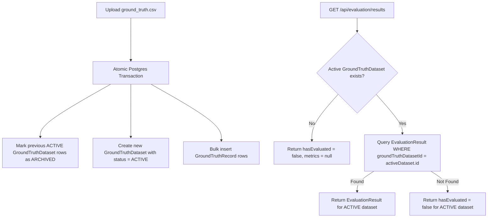

# ReconcileAI — Ground Truth Evaluation Methodology & Metrics
## Razorpay Hackathon 2026 — Track 04: AI Finance Controller

This document provides the mathematical formulations, dataset scoping architecture, confusion matrix definitions, and evaluation workflows used by **ReconcileAI** to benchmark automated reconciliation decisions against ground-truth datasets.

---

## 1. Ground Truth Architecture & Schema

Ground Truth evaluation in ReconcileAI allows financial analysts and auditors to upload verified benchmark datasets (`ground_truth.csv`) and measure the accuracy, precision, recall, and F1 scores of the reconciliation engine.

### Database Entities
- **`GroundTruthDataset`**: Versioned benchmark dataset container (`filename`, `recordCount`, `status`: `ACTIVE` | `ARCHIVED`, `uploadedBy`, `createdAt`).
- **`GroundTruthRecord`**: Per-transaction ground truth row (`transactionId`, `groundTruthStatus`: `MATCHED` | `REVIEW` | `EXCEPTION`, `groundTruthReason`, `expectedExceptionCategory`).
- **`EvaluationResult`**: Persisted evaluation run (`totalGtRecords`, `matchedEvalRecords`, `unmatchedGtRecords`, `correctPredictions`, `incorrectPredictions`, `accuracy`, `precisionMacro`, `recallMacro`, `f1Macro`, `f1Weighted`, `perClassMetrics`, `confusionMatrix`).

---

## 2. Strict Dataset Scoping & Zero Stale Metrics Architecture

To prevent stale or misaligned metrics when a new ground-truth CSV is uploaded:



### Key Integrity Guarantees
1. **Atomic Dataset Archiving**: Uploading a new `ground_truth.csv` immediately marks all existing active ground-truth datasets as `ARCHIVED` within an atomic Prisma transaction.
2. **Strict Scoping**: `getEvaluationResults` explicitly filters `EvaluationResult` by `groundTruthDatasetId: activeDataset.id`.
3. **Zero Stale Metrics**: When a new ground-truth CSV (e.g., 250 records) is uploaded, old metrics (e.g., from a 100-record dataset) are instantly hidden until the user clicks **RUN EVALUATION** for the new active dataset.

---

## 3. Mathematical Metrics Formulations

Let $C = \{\text{MATCHED}, \text{REVIEW}, \text{EXCEPTION}\}$ be the set of valid reconciliation statuses.

### 3.1 Accuracy
Accuracy measures the proportion of total ground-truth records correctly classified by ReconcileAI:

$$\text{Accuracy} = \left( \frac{\sum_{c \in C} TP_c}{N_{\text{total}}} \right) \times 100$$

where $TP_c$ is the true positive count for class $c$, and $N_{\text{total}}$ is the total number of evaluated ground-truth records.

### 3.2 Per-Class Metrics (Precision, Recall, F1-Score)
For each status category $c \in \{\text{MATCHED}, \text{REVIEW}, \text{EXCEPTION}\}$:

- **Precision ($P_c$)**:
  $$P_c = \frac{TP_c}{TP_c + FP_c}$$

- **Recall ($R_c$)**:
  $$R_c = \frac{TP_c}{TP_c + FN_c}$$

- **F1-Score ($F1_c$)**:
  $$F1_c = 2 \times \frac{P_c \times R_c}{P_c + R_c}$$

### 3.3 Macro F1 Score
Macro F1 computes the unweighted arithmetic mean of F1 scores across all classes, giving equal weight to `MATCHED`, `REVIEW`, and `EXCEPTION`:

$$\text{Macro F1} = \frac{1}{|C|} \sum_{c \in C} F1_c = \frac{F1_{\text{MATCHED}} + F1_{\text{REVIEW}} + F1_{\text{EXCEPTION}}}{3}$$

### 3.4 Weighted F1 Score
Weighted F1 computes the weighted average of F1 scores, accounting for class imbalance in ground-truth dataset distributions:

$$\text{Weighted F1} = \sum_{c \in C} \left( \frac{N_c}{N_{\text{total}}} \right) \times F1_c$$

where $N_c$ is the ground-truth record count for class $c$.

---

## 4. 3x3 Confusion Matrix Structure

The ground-truth evaluation generates a $3 \times 3$ confusion matrix mapping actual ground-truth classifications (rows) against ReconcileAI predicted classifications (columns):

| Actual \ Predicted | Predicted MATCHED | Predicted REVIEW | Predicted EXCEPTION | Total Actual |
| :--- | :---: | :---: | :---: | :---: |
| **Actual MATCHED** | $TP_{\text{MATCHED}}$ | $E_{\text{M}\rightarrow\text{R}}$ | $E_{\text{M}\rightarrow\text{E}}$ | $N_{\text{MATCHED}}$ |
| **Actual REVIEW** | $E_{\text{R}\rightarrow\text{M}}$ | $TP_{\text{REVIEW}}$ | $E_{\text{R}\rightarrow\text{E}}$ | $N_{\text{REVIEW}}$ |
| **Actual EXCEPTION** | $E_{\text{E}\rightarrow\text{M}}$ | $E_{\text{E}\rightarrow\text{R}}$ | $TP_{\text{EXCEPTION}}$ | $N_{\text{EXCEPTION}}$ |

---

## 5. Benchmark Performance Results

Evaluation results from automated test executions across reference datasets:

### 5.1 100-Record Benchmark Dataset
- **Evaluated Records**: 100
- **Accuracy**: **96.0%**
- **Macro F1**: **92.22%**
- **Weighted F1**: **96.07%**

### 5.2 250-Record Benchmark Dataset (`data/dataset_250/`)
- **Evaluated Records**: 250
- **Accuracy**: **69.2%**
- **Macro F1**: **69.67%**
- **Weighted F1**: **70.15%**
- **Scenario Mixture**: `EXACT_MATCH` (44), `FEE_ADJUSTED` (28), `REFUND_ADJUSTED` (30), `AMOUNT_MISMATCH` (21), `MISSING_SETTLEMENT` (18), `DUPLICATE_TRANSACTION` (36), `PARTIAL_SETTLEMENT` (26), `UNKNOWN_TRANSACTION` (23), `DATE_MISMATCH` (24).

---

## 6. Evaluation API Endpoints

### 1. `POST /api/evaluation/upload-ground-truth`
- **Role Permissions**: `ADMIN`, `ANALYST`
- **Request**: `multipart/form-data` with `file: ground_truth.csv`
- **Response**:
  ```json
  {
    "success": true,
    "message": "Ground truth uploaded successfully",
    "filename": "ground_truth.csv",
    "recordCount": 250,
    "datasetId": "b4579c58-0524-4758-9b85-ee746decfadf"
  }
  ```

### 2. `POST /api/evaluation/run`
- **Role Permissions**: `ADMIN`, `ANALYST`
- **Request**: `{ "runId": "optional-run-id", "groundTruthDatasetId": "optional-dataset-id" }`
- **Response**: Returns full evaluation metrics payload containing accuracy, precision, recall, macro F1, weighted F1, per-class metrics, and confusion matrix.

### 3. `GET /api/evaluation/results`
- **Role Permissions**: `ADMIN`, `ANALYST`, `VIEWER`
- **Response**: Fetches current active ground-truth dataset and evaluation metrics strictly associated with it.
