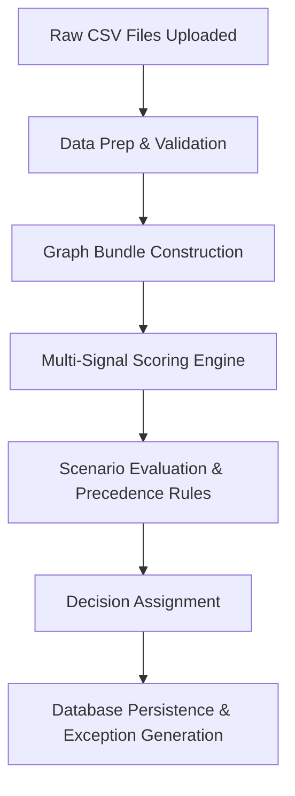
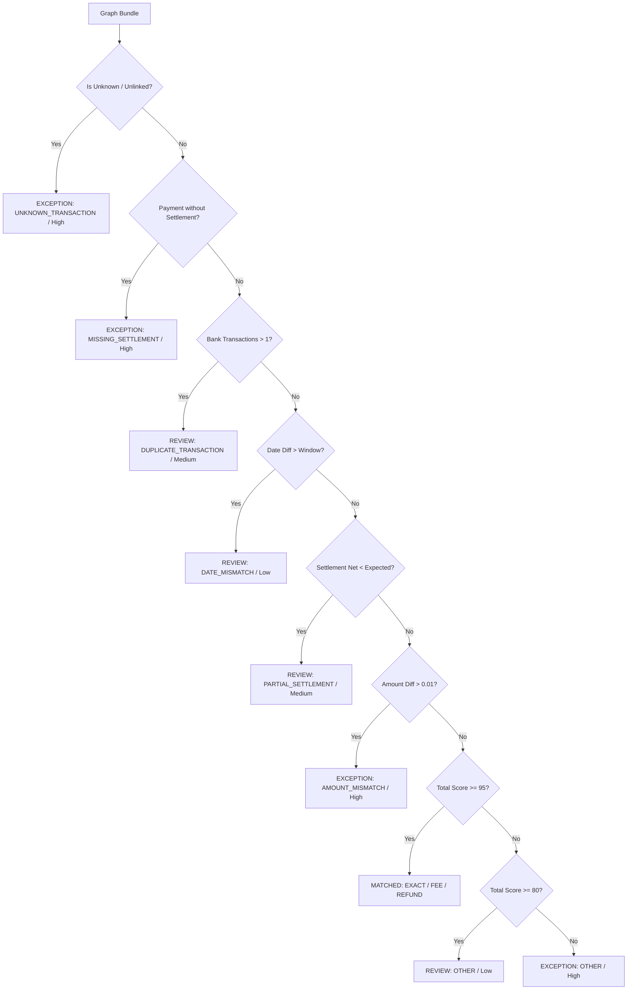

# ReconcileAI — Reconciliation Workflow & Matching Specifications
## Razorpay Hackathon 2026 — Track 04: AI Finance Controller

This document provides an exhaustive breakdown of the multi-source financial reconciliation engine, relational graph construction, signal scoring algorithms, financial scenario rules, decision precedence, and database persistence mechanisms in **ReconcileAI**.

---

## 1. Overview of 5-Source Financial Data Ingestion

ReconcileAI reconciles financial records across 5 distinct data sources:

| Source File | Entity Model | Primary Identifier | Key Relational Keys | Mandatory Schema Columns |
| :--- | :--- | :--- | :--- | :--- |
| `orders.csv` | `Order` | `order_id` | `payment_id`, `customer_id` | `order_id`, `customer_id`, `order_date`, `order_amount`, `currency`, `payment_id`, `order_status` |
| `payments.csv` | `Payment` | `payment_id` | `order_id`, `transaction_id` | `payment_id`, `order_id`, `transaction_id`, `payment_date`, `payment_time`, `amount`, `payment_status`, `payment_method` |
| `settlements.csv` | `Settlement` | `settlement_id` | `transaction_id` | `settlement_id`, `transaction_id`, `settlement_date`, `gross_amount`, `fee`, `tax`, `net_amount`, `settlement_status` |
| `bank_transactions.csv` | `BankTransaction` | `bank_transaction_id` | `settlement_id`, `reference` | `bank_transaction_id`, `settlement_id`, `transaction_date`, `transaction_time`, `reference`, `credit_amount`, `bank_status` |
| `refunds.csv` | `Refund` | `refund_id` | `transaction_id` | `refund_id`, `transaction_id`, `refund_date`, `refund_amount`, `refund_status`, `refund_reason` |

---

## 2. Pipeline Execution Lifecycle



### Stage 1: Data Preparation & Validation (`app/validation.py`)
1. **DataFrame Coercion**: Uploaded JSON/CSV dictionary arrays are converted into Pandas DataFrames.
2. **Numeric Cleaning**: Monetary fields (`order_amount`, `amount`, `gross_amount`, `fee`, `tax`, `net_amount`, `credit_amount`, `refund_amount`) are cast to float and rounded to 2 decimal places.
3. **Date Normalization**: Dates are parsed to ISO string format (`YYYY-MM-DD`). Days difference between dates is computed via `calculate_days_diff(date1, date2)`.

---

## 3. Relational Graph Construction (`app/matching.py`)

Financial transactions are rarely 1:1 identical across all 5 files due to Gateway fees, taxes, partial settlements, refunds, and bank batching.

The Python decision engine constructs a relational graph linking records into **Transaction Graph Bundles**:

1. **Transaction ID Indexing**: Collects all unique `transaction_id` references across Payments, Settlements, Refunds, and Bank References.
2. **Bundle Aggregation**: For each transaction ID, the engine builds a graph bundle:
   ```json
   {
     "transaction_id": "TX250001",
     "order": { ... },
     "payment": { ... },
     "settlement": { ... },
     "bank_transactions": [ { ... } ],
     "refund": { ... },
     "is_unknown": false
   }
   ```
3. **Orphan / Unknown Transaction Detection**: Bank statement entries that cannot be linked to any payment or settlement record are bundled with `is_unknown = True`.

---

## 4. Multi-Signal Scoring Engine (`app/scoring.py`)

For every transaction graph bundle, the scoring engine calculates 5 weighted signal scores totaling **100 Points**:

```text
Total Confidence Score = Signal_TxID + Signal_RelatedIDs + Signal_AmountRecon + Signal_DateWindow + Signal_BankRef
```

| Signal | Maximum Score | Evaluation Criteria |
| :--- | :---: | :--- |
| **1. Transaction ID Match** | **40 Points** | `+40` if payment `transaction_id` matches bundle ID or settlement `transaction_id` matches bundle ID. |
| **2. Related IDs Match** | **20 Points** | `+10` if `order.payment_id == payment.payment_id` or `order.order_id == payment.order_id`.<br>`+10` if `settlement.transaction_id == payment.transaction_id`. |
| **3. Amount Reconciliation Match** | **20 Points** | Calculates `expected_bank_amount = gross_amount - fee - tax - refund_amount`.<br>`+20` if `abs(actual_bank_amount - expected_bank_amount) < 0.01`<br>`+10` if difference is `< 10.0`<br>`+0` if difference is `>= 10.0`. |
| **4. Settlement Date Window** | **10 Points** | `+10` if `max_date_diff(payment_date, settlement_date, bank_date) <= settlementWindowDays` (Default: 2 days). |
| **5. Bank Reference Match** | **10 Points** | `+10` if bank transaction `reference` equals `transaction_id`. |

---

## 5. Financial Scenarios & Precedence Rules

The decision engine applies strict precedence rules to determine the final status (`MATCHED`, `REVIEW`, `EXCEPTION`), exception category, severity, and human-readable explanation:



### Breakdown of All 9 ReconcileAI Scenarios

#### 1. `UNKNOWN_TRANSACTION` (Exception, High Severity)
- **Condition**: Bank transaction cannot be linked to any known payment or settlement record.
- **Status**: `EXCEPTION` | **Confidence**: 10.0%
- **Reason**: *"Bank transaction cannot be linked to any known payment or settlement record."*

#### 2. `MISSING_SETTLEMENT` (Exception, High Severity)
- **Condition**: Payment captured successfully, but no settlement record exists.
- **Status**: `EXCEPTION` | **Confidence**: 35.0%
- **Reason**: *"No settlement record was found for this transaction."*

#### 3. `DUPLICATE_TRANSACTION` (Review, Medium Severity)
- **Condition**: Multiple bank statement entries (`> 1`) reference the same settlement ID.
- **Status**: `REVIEW` | **Confidence**: 88.0%
- **Reason**: *"Duplicate bank transaction detected (N bank entries reference settlement SET...). Requires human review."*

#### 4. `DATE_MISMATCH` (Review, Low Severity)
- **Condition**: Max date difference between payment, settlement, and bank credit exceeds `settlementWindowDays` (e.g. 45 days late).
- **Status**: `REVIEW` | **Confidence**: 88.0%
- **Reason**: *"The transaction dates are outside the configured settlement window."*

#### 5. `PARTIAL_SETTLEMENT` (Review, Medium Severity)
- **Condition**: Settlement net amount is significantly lower than expected gross minus fees (`abs(settlement_net - expected_net) > 1.0`).
- **Status**: `REVIEW` | **Confidence**: 85.0%
- **Reason**: *"Settlement net amount is lower than expected gross minus fees. Requires review."*

#### 6. `AMOUNT_MISMATCH` (Exception, High Severity)
- **Condition**: Expected bank credit (`gross - fee - tax - refund`) differs from actual bank credit by `> ₹0.01` without an explanatory fee, tax, or refund record.
- **Status**: `EXCEPTION` | **Confidence**: 40.0%
- **Reason**: *"The expected bank credit is ₹X, while actual bank credit is ₹Y. No recorded fee, tax or refund explains the difference."*

#### 7. `EXACT_MATCH` (Matched)
- **Condition**: Score `>= 95%`, zero fee, zero tax, zero refund, exact gross & bank credit match.
- **Status**: `MATCHED` | **Confidence**: 100.0%
- **Reason**: *"Exact match confirmed across order, payment, settlement, and bank credit."*

#### 8. `FEE_ADJUSTED` (Matched)
- **Condition**: Score `>= 95%`, gateway fees and GST taxes verified against gross settlement.
- **Status**: `MATCHED` | **Confidence**: 100.0%
- **Reason**: *"The gross amount is ₹X. Fee of ₹F and tax of ₹T yield net amount of ₹N, matching actual bank credit."*

#### 9. `REFUND_ADJUSTED` (Matched)
- **Condition**: Score `>= 95%`, partial/full customer return verified against net settlement.
- **Status**: `MATCHED` | **Confidence**: 100.0%
- **Reason**: *"Fee of ₹F, tax of ₹T, and refund of ₹R yield expected net credit of ₹N, matching actual bank credit."*

---

## 6. Database Persistence & Metrics Computation

When reconciliation completes, backend service `reconciliationService.ts` executes an atomic Prisma transaction:

1. **`ReconciliationRun` Creation**: Records `startedAt`, `completedAt`, `totalRecords`, `matchedCount`, `reviewCount`, `exceptionCount`, `matchRate`, `processingTimeMs`, and `throughput`.
2. **`ReconciliationResult` Rows**: Inserts per-transaction outcome, confidence score, evidence JSON, amount diff, and date diff.
3. **`Exception` Rows**: Creates linked exception entries for `REVIEW` and `EXCEPTION` statuses.
4. **`AuditLog` Entry**: Logged as `RECONCILIATION_COMPLETED`.

### Operational Performance Metrics Formulations
- **Match Rate (%)**: 
  $$\text{Match Rate} = \left( \frac{\text{Matched Count}}{\text{Total Processed Records}} \right) \times 100$$
- **Throughput (records/sec)**:
  $$\text{Throughput} = \frac{\text{Total Processed Records}}{\max(\text{Processing Time in Seconds}, 0.001)}$$
